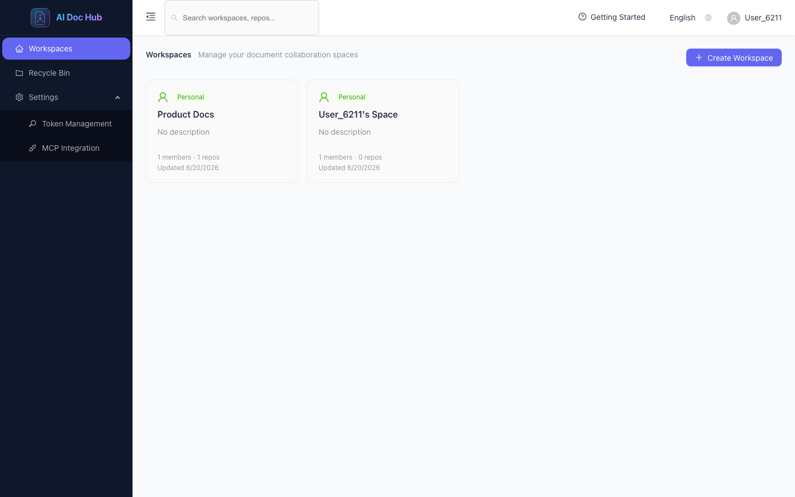
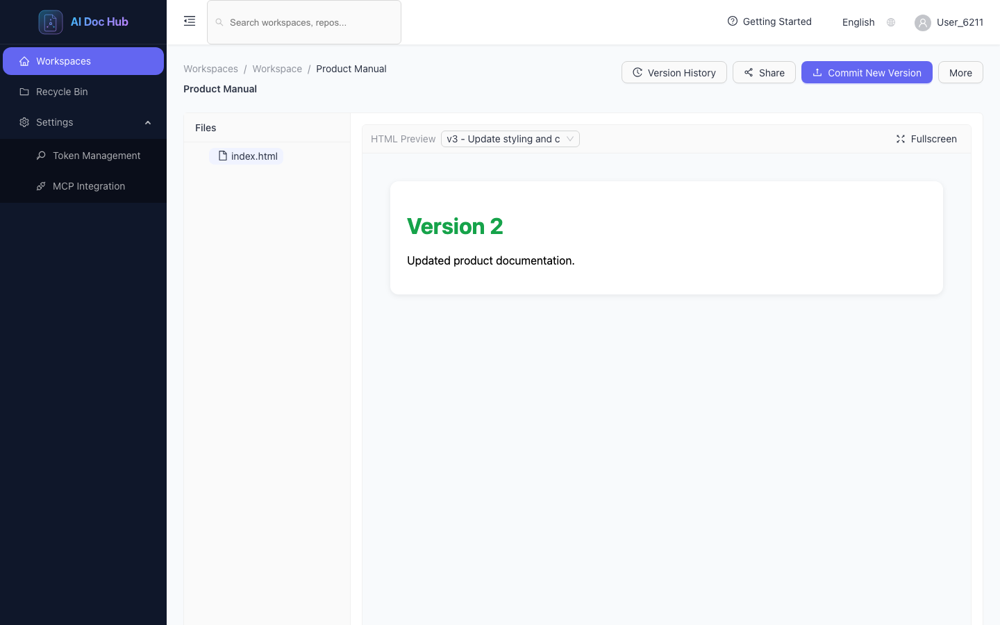
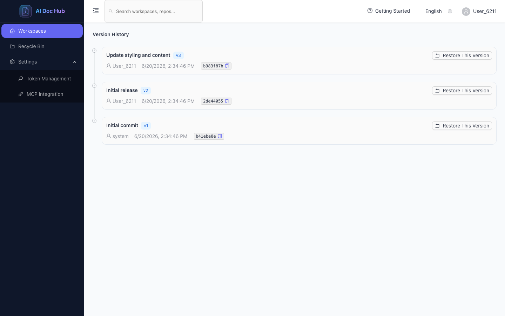
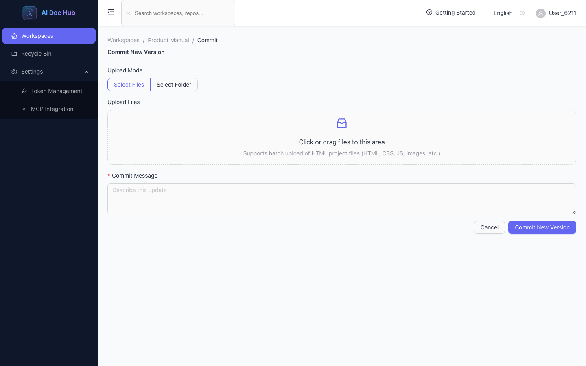
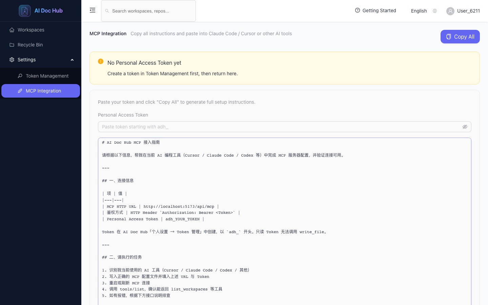
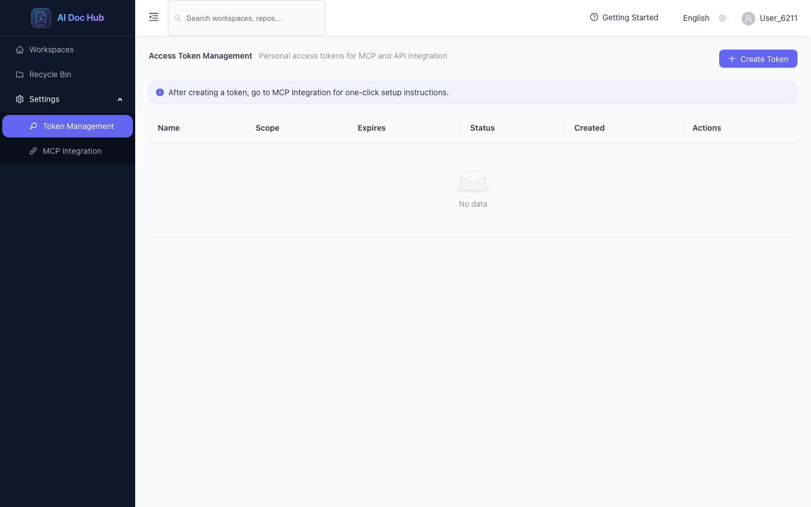

<div align="center">

# AI Doc Hub

**Enterprise open-source platform for HTML asset version management, team collaboration, and AI-native workflows.**

[English](README.md) · [简体中文](README_zh-CN.md)

Maintained by [**leven-space**](https://github.com/leven-space)

[Quick Start](#quick-start) · [Features](#features) · [Screenshots](#screenshots) · [MCP Integration](#mcp-integration) · [Architecture](#architecture) · [Contributing](CONTRIBUTING.md)

<br/>

[](LICENSE)
[](https://nodejs.org/)
[](https://pnpm.io/)
[](https://nestjs.com/)
[](https://react.dev/)
[](https://playwright.dev/)

<br/>

[](https://github.com/leven-space/aidoc-hub/stargazers)
[](https://github.com/leven-space/aidoc-hub/network/members)
[](https://github.com/leven-space/aidoc-hub/issues)
[](https://github.com/leven-space/aidoc-hub/pulls)
[](https://github.com/leven-space/aidoc-hub/graphs/contributors)
[](https://github.com/leven-space/aidoc-hub/commits/main)

<br/>



<sub>Workspace-centric organization for HTML document repositories</sub>

</div>

---

## About

AI Doc Hub helps teams **manage, version, preview, and share HTML assets** without treating everyone like a developer. Built around **workspaces** and **Git-backed linear versioning**, it also exposes a **standard MCP (Model Context Protocol)** interface so tools like **Cursor**, **Claude Code**, and **Windsurf** can read and write documentation programmatically.

> **Status:** Active development — APIs and UI may change between releases.

| For | AI Doc Hub provides |
|-----|---------------------|
| **Product / ops teams** | Upload HTML packs, preview in browser, share read-only links |
| **Editors** | Version history, diff, restore, folder upload |
| **Developers / AI agents** | REST API + PAT + MCP `read_file` / `write_file` |
| **Admins** | Roles, audit logs, recycle bin, system configuration |

---

## Screenshots

<table>
  <tr>
    <td align="center"><b>Workspaces</b></td>
    <td align="center"><b>HTML Preview</b></td>
    <td align="center"><b>Version History</b></td>
  </tr>
  <tr>
    <td></td>
    <td></td>
    <td></td>
  </tr>
  <tr>
    <td align="center"><b>Commit New Version</b></td>
    <td align="center"><b>MCP Integration</b></td>
    <td align="center"><b>Access Tokens</b></td>
  </tr>
  <tr>
    <td></td>
    <td></td>
    <td></td>
  </tr>
</table>

---

## Features

### Core

- **Workspace-centric model** — Top-level containers with **Admin / Editor / Viewer** roles and member management
- **Git-based versioning** — Single-trunk linear history via `isomorphic-git`; every change is a commit with message and OID
- **HTML preview** — In-app rendered preview with sanitization ([DOMPurify](https://github.com/cure53/DOMPurify))
- **Version operations** — History timeline, side-by-side diff, restore to any revision (new commit, history preserved)
- **Batch upload** — Files or whole folders; supports HTML, CSS, JS, and images

### Collaboration & sharing

- **Dual-mode share links** — **View only** (preview) or **source access** (read source + collaborate)
- **Share controls** — Optional password, expiration, visit limits, download permission
- **Global search** — Find workspaces and repositories quickly
- **Recycle bin** — Soft-delete workspaces/repos with restore within retention window

### AI & automation

- **Personal Access Tokens (PAT)** — `adh_` tokens with `READ` or `READ_WRITE` scope
- **MCP server** — HTTP Streamable MCP at `/api/mcp` with tools:
  - `list_workspaces` · `list_repositories` · `read_file` · `write_file` · `get_version_history`
- **Setup snippets** — Copy-paste MCP config for Cursor / Claude Code / Codex

### Enterprise-oriented

- **Audit logs** — Track sensitive operations (system admin)
- **JWT + PAT auth** — Cookie and Bearer token support
- **i18n** — Chinese and English UI
- **E2E tests** — Playwright coverage for UI flows, MCP API, and version restore ([`docs/test-cases.md`](docs/test-cases.md))

---

## Quick Start

### Prerequisites

- [Node.js](https://nodejs.org/) **>= 18**
- [pnpm](https://pnpm.io/) **>= 8**
- [Docker](https://www.docker.com/) (for PostgreSQL via Compose)

### Local development

```bash
git clone https://github.com/leven-space/aidoc-hub.git
cd aidoc-hub
pnpm install

docker compose up -d postgres
cp backend/.env.example backend/.env   # optional; defaults work for local Postgres

cd backend && npx prisma db push && cd ..
pnpm dev
```

| Service | URL |
|---------|-----|
| Frontend | http://localhost:5173 |
| Backend API | http://localhost:3000/api |

First visit opens **system setup** (admin account + site config), then register users and create workspaces.

### Docker Compose (full stack)

```bash
docker compose up -d
```

### Run E2E tests

```bash
pnpm test:e2e
```

See [`docs/test-results.md`](docs/test-results.md) for the latest automated test report.

---

## MCP Integration

Connect your AI client to manage documentation in your workspace:

```json
{
  "mcpServers": {
    "aidoc-hub": {
      "url": "https://your-host/api/mcp",
      "headers": {
        "Authorization": "Bearer adh_YOUR_TOKEN"
      }
    }
  }
}
```

Typical agent workflow:

1. `list_workspaces` → get `workspaceId`
2. `list_repositories` → get `repoId`
3. `read_file` / `write_file` / `get_version_history`

Create tokens under **Settings → Token Management**. `write_file` requires **READ_WRITE** PAT and **Editor** role (or higher).

---

## Architecture

```
┌─────────────────────────────────────────────────────┐
│              Frontend SPA (Vite · React · Ant Design) │
├─────────────────────────────────────────────────────┤
│         Backend API (NestJS · Prisma · JWT · MCP)     │
├─────────────────────────────────────────────────────┤
│    PostgreSQL 18  ·  isomorphic-git (per-repo storage) │
└─────────────────────────────────────────────────────┘
```

| Module | Responsibility |
|--------|----------------|
| `auth` | Register/login, JWT, PAT |
| `workspace` | Workspaces, members, roles |
| `repo` | Repositories, commits, files, preview, download |
| `git` | Version control engine |
| `version` | History, diff, restore |
| `share` | Share links and public access |
| `mcp` | Model Context Protocol server |
| `audit` | Audit log queries |
| `system` | Setup and public configuration |

Monorepo layout: `backend/` (NestJS) + `frontend/` (React SPA). Details in [AGENTS.md](AGENTS.md).

---

## Tech Stack

| Layer | Technologies |
|-------|----------------|
| Backend | NestJS, Prisma, PostgreSQL 18, isomorphic-git, MCP SDK, Passport JWT, DOMPurify |
| Frontend | React 19, Vite, Ant Design 6, Monaco Editor, React Router, Axios |
| Tooling | pnpm workspaces, Docker Compose, Playwright, Husky, commitlint |

---

## Project Structure

```
aidoc-hub/
├── backend/           # NestJS API + Prisma
├── frontend/          # React SPA + Playwright E2E
├── docs/              # Test docs, README screenshots
├── scripts/           # Utility scripts (e.g. screenshot capture)
├── docker-compose.yml
└── playwright.config.ts
```

---

## Contributing

We welcome issues, docs improvements, and pull requests.

1. Read [AGENTS.md](AGENTS.md) and [CONTRIBUTING.md](CONTRIBUTING.md)
2. Fork → branch (`feat/…` / `fix/…`) → commit (Conventional Commits) → PR
3. Run `pnpm lint` and `pnpm build` before submitting

---

## Star History

[](https://star-history.com/#leven-space/aidoc-hub&Date)

---

## Contributors

Thanks to everyone who contributes to AI Doc Hub.

<a href="https://github.com/leven-space/aidoc-hub/graphs/contributors">
  
</a>

Made with [contrib.rocks](https://contrib.rocks).

---

## License

[MIT License](LICENSE) — Copyright (c) 2026 AI Doc Hub Contributors

---

<div align="center">

**[⬆ back to top](#ai-doc-hub)**

If this project helps you, consider giving it a **⭐** on GitHub.

</div>
